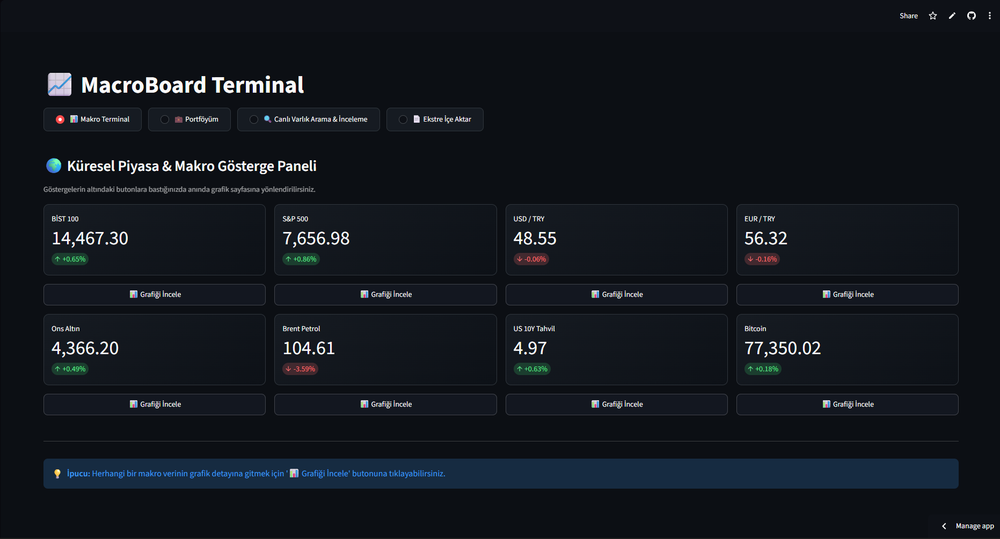
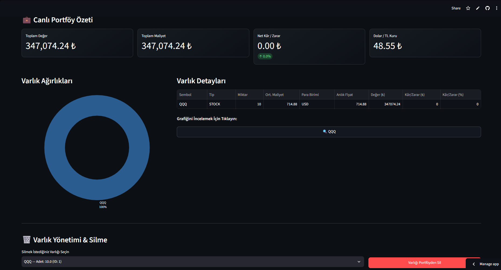
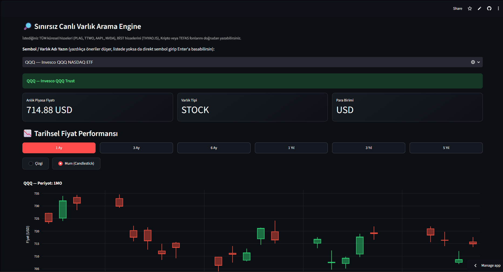
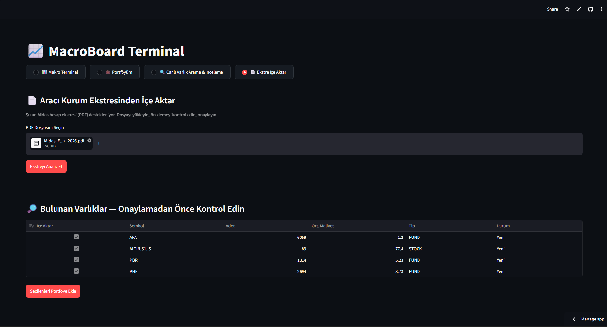

# 📈 MacroBoard - Finansal & Makro Veri Terminali

🔗 **[Canlı Demo](https://macroboard.streamlit.app)** — tarayıcıdan doğrudan deneyebilirsiniz.
*(İlk açılışta backend "uyanma" süresi nedeniyle 30-50 saniye gecikme olabilir.)*

\## 🏗️ Mimari ve Teknolojiler

\* \*\*Backend:\*\* FastAPI, Python

\* \*\*Frontend:\*\* Streamlit, Plotly

\* \*\*Veritabanı / ORM:\*\* SQLite, SQLAlchemy

\* \*\*Veri Kaynakları:\*\* yfinance (ABD \& BİST hisseleri, döviz, emtia), tefas-crawler (TEFAS fonları)

\## ✨ Özellikler

\* Çoklu varlık desteği (ABD hisseleri, BİST, TEFAS fonları)

\* Döviz çevirici motoru (USD/TRY otomatik dönüşüm)

\* Kâr/Zarar (P/L) analitiği, varlık ve portföy bazında

\* Makro gösterge paneli (Dolar/TL, Altın, Petrol, S\&P500, BİST100, Bitcoin)

\* Aracı kurum PDF ekstresinden otomatik portföy içe aktarma (Midas desteği)

\* İnteraktif arama ve çoklu zaman aralığı (1A-5Y) grafikleri

## 📸 Ekran Görüntüleri

### Makro Terminal

### Portföyüm

### Canlı Varlık Arama

### Ekstre İçe Aktarma (PDF)

\## 🚀 Kurulum

\\`\\`\\`bash

git clone https://github.com/KULLANICI\_ADI/macroboard.git

cd macroboard

python -m venv venv

venv\\Scripts\\activate

pip install -r requirements.txt

\# 1. Terminal

uvicorn app.main:app --reload

\# 2. Terminal

streamlit run dashboard.py

\\`\\`\\`

